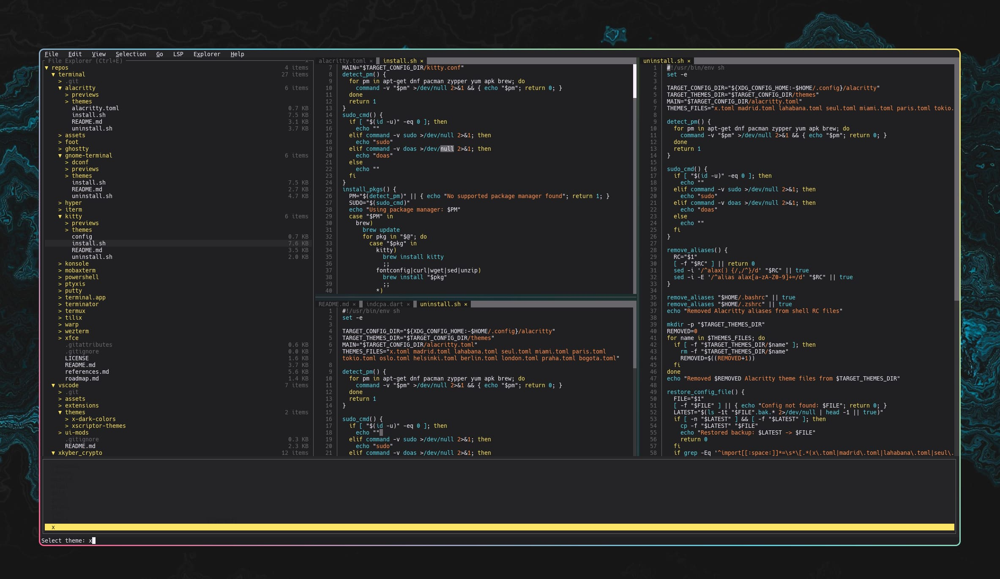
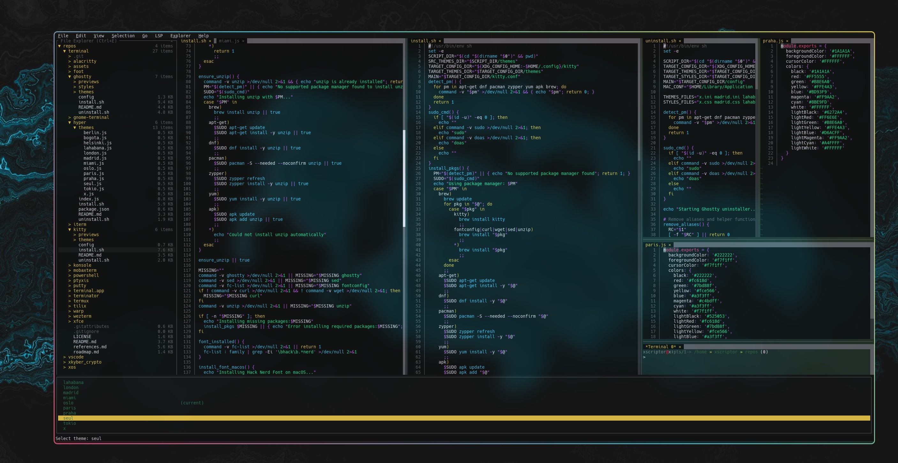
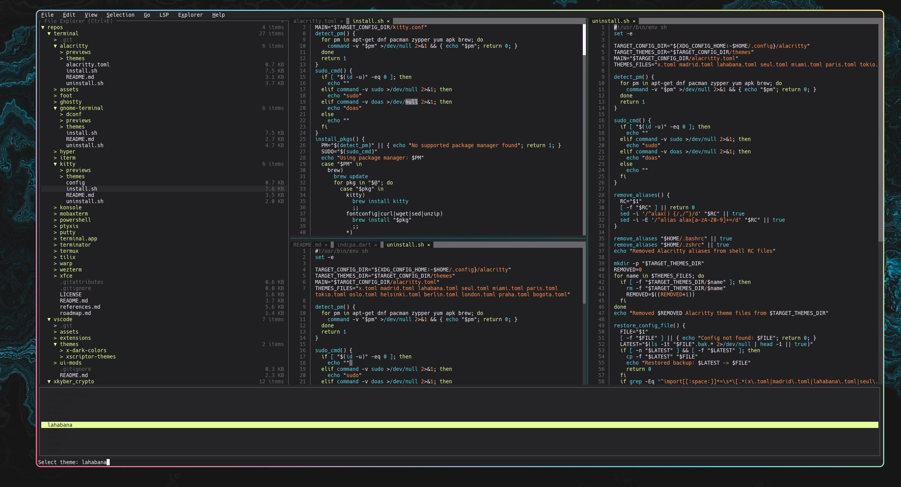
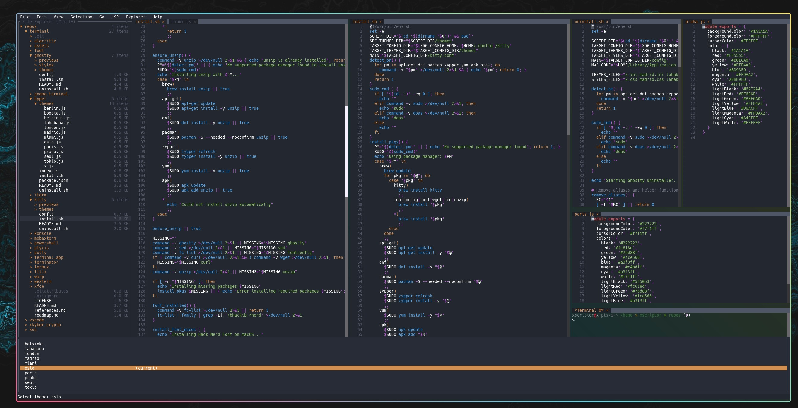
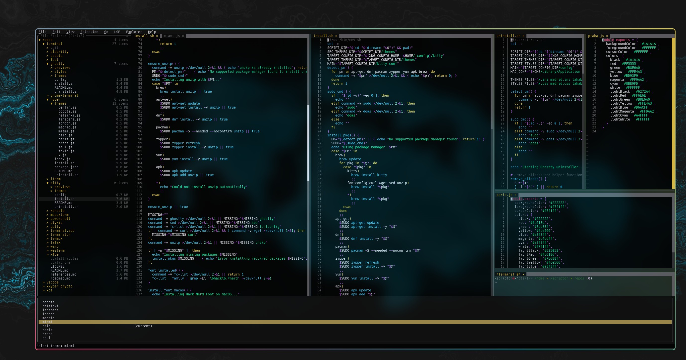
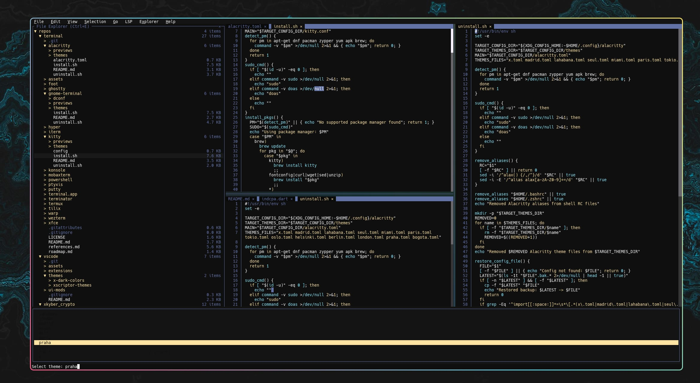

<h1 align="center"> Fresh Xscriptor </h1>

Xscriptor themes for Fresh

# Previews

  

  
More previews

  <table>
    <tr>
      <td align="center">
        
      </td>
      <td align="center">
        
      </td>
      <td align="center">
        
      </td>
      <td align="center">
        
      </td>
      <td align="center">
        
      </td>
      <td align="center">
        
      </td>
    </tr>
  </table>

Repository under construction, you can find the files inside the themes folder.